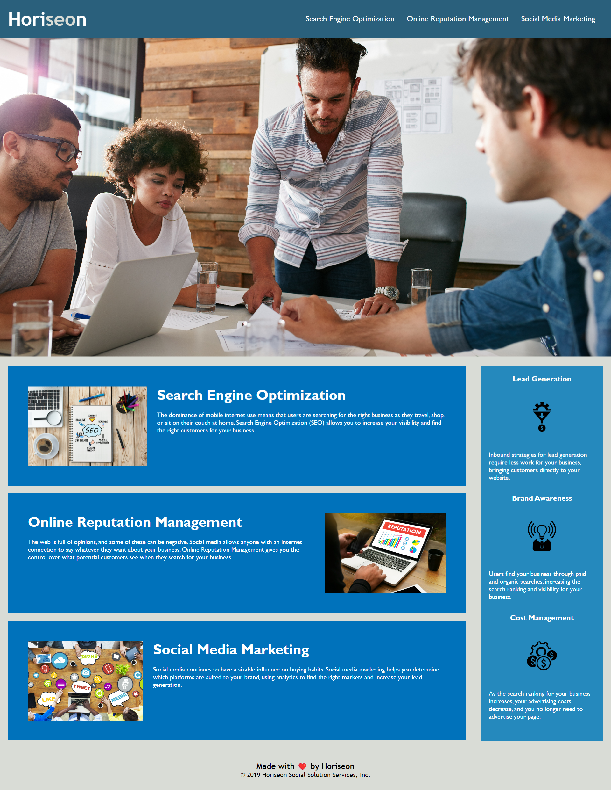

# module-1-assignment
# Code Refactor

## Description: 

I built this project to improve the accessibility standards of the marketing agency, Horiseon, through the addition of semantic HTML and alt attributes. I also reviewed the code, removing any unneccessary tags or elements for maximum efficiency and easier readability for developers, as well as refining the title of the webpage that appears on the browser tab. Altogether, this enhances the ranking of the site for search engines and decreases advertising costs for the company as a result.

I have added comments in the CSS file above every CSS rule for the benefit of understanding each code refactor.

## Deployed link: 
https://adammbnitro.github.io/module-1-assignment/

## How to Contribute

There are many ways in which you can participate in this project, for example:

1. Submit bugs and feature requests, and help us verify as they are checked in
2. Review source code changes
3. Review the documentation and make pull requests for anything from typos to additional and new content

If you are interested in fixing issues and contributing directly to the code base, please contact us and read the following: https://www.contributor-covenant.org/version/2/1/code_of_conduct/

## License

Copyright (c) Horiseon. All rights reserved.

Licensed under the MIT license.

